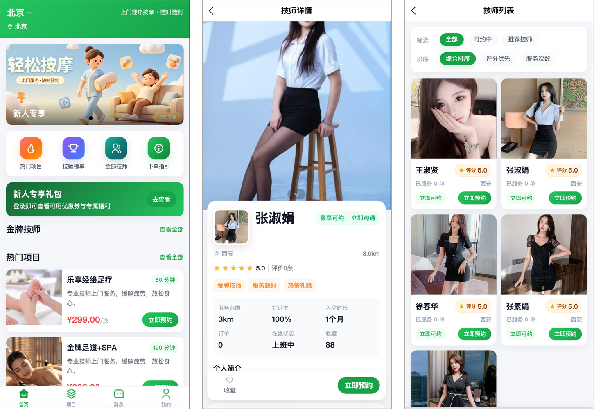
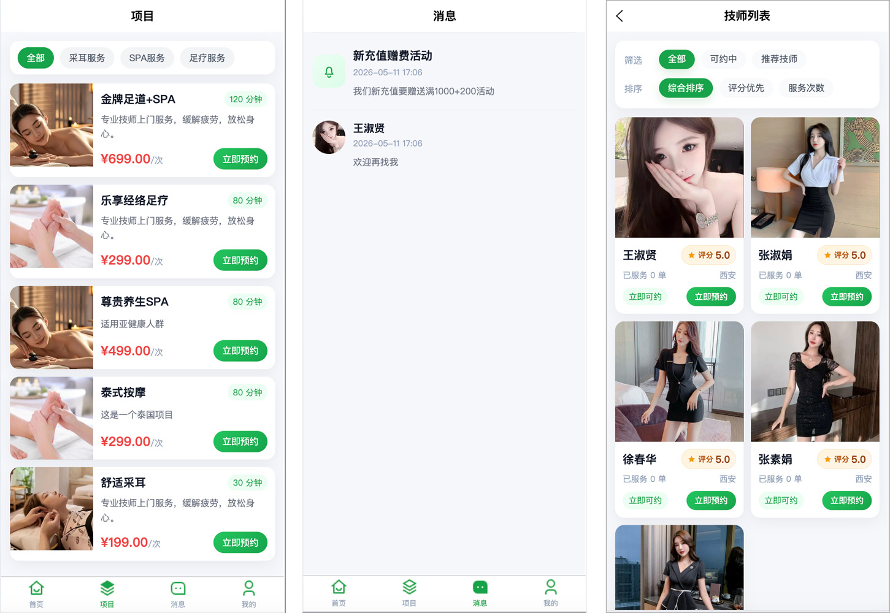
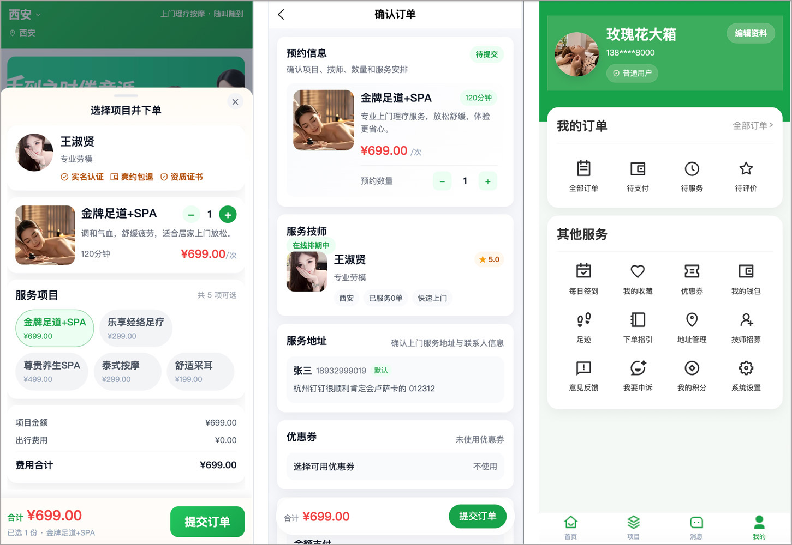
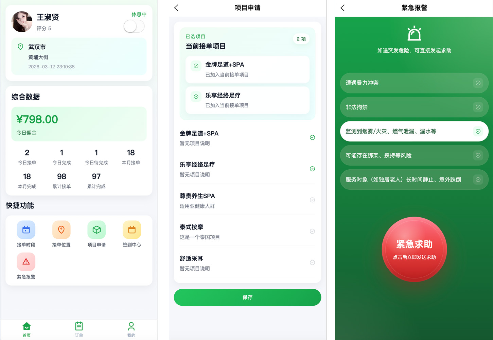
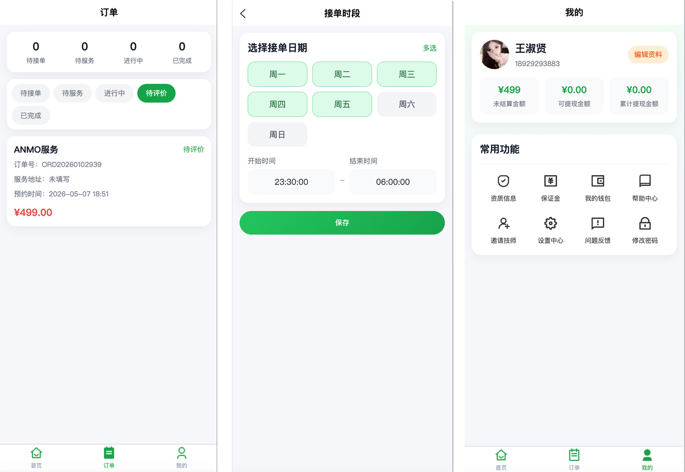
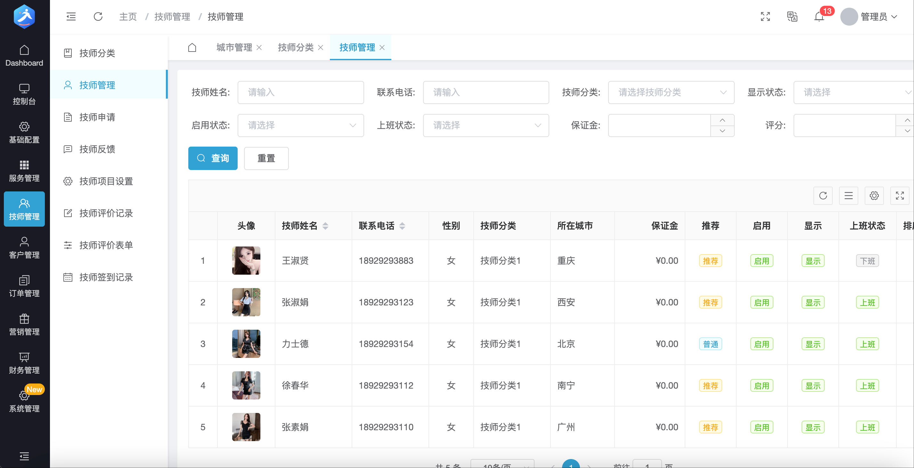
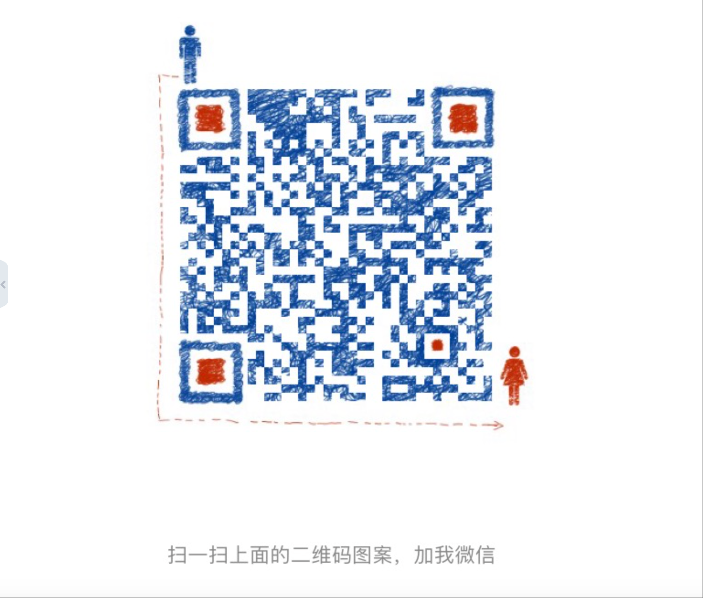

# 喜悦到家-JAVA-Springboot-vue家政按摩预约到家,参考模仿东郊到家等。

# 主要功能

| 系统  | 功能说明  |
|---|---|
| 用户端  | 提供手机端h5，提供让用户注册、浏览项目、浏览技师信息、下单、追踪订单等服务；  |
| 技师端  | 提供手机端h5，提供让技师登录、设置上下线状态、接单、操作订单、管理订单等服务；  |
| 运营管理端  | 提供web后台给管理运营者，主要包含订单管理、用户管理、财务管理、消息管理、技师管理、统计报表等等功能  |

# 主要技术栈

- springboot
- mybatisplus
- mysql
- vue
- uniapp

# 截图预览

## 用户端

## 技师端

## 管理后台运营端

# 联系我获取源码~~

